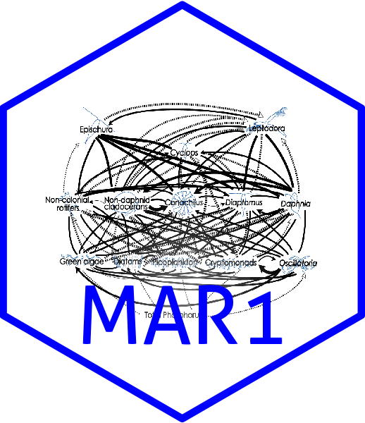

MAR1: Multivariate Autoregressive Modeling for Analysis of Community Time-Series Data

[](https://cran.r-project.org/package=MAR1)
[](https://github.com/atsa-es/MAR1/releases/latest)
[](https://github.com/atsa-es/MAR1/actions/workflows/check-r-package.yml)
[](https://github.com/r-hub/cranlogs.app)
[](https://www.r-pkg.org/pkg/MAR1)

To install MAR1 from CRAN:
```
install.packages("MAR1")
library(MAR1)
```
To install from our r-universe repository:
```
install.packages('MAR1', repos = c('https://atsa-es.r-universe.dev', 'https://cloud.r-project.org'))
```


## Description

Ives et al. (2003) describe the model framework implemented in this package:

$$\mathbf{X}(t) = \mathbf{A} + \mathbf{BX}(t-1) + \mathbf{CU}(t-1) + \mathbf{E}(t)$$

The first order multivariate autoregressive model may include both variates (factors expected to affect their own dynamics and the dynamics of other variates) and covariates (factors that may affect the dynamics of variates but are unlikely to be correspondingly influenced by them).  The model estimates the value of each variate at time $t$ as a linear function of the values of all variates and covariates at time $t-1$.  The coefficients estimated in the MAR model represent the relative interaction strengths between each variate and covariate included in the analysis.
}

## Details

The MAR1 package includes the following basic functions:

* `prepare.data` Formats a dataset into evenly-spaced time-steps and marks continuous blocks of time-steps in preparation for MAR analysis.  The data can also be log-transformed or z-scored with this function.

* `run.mar` Searches for and estimates a MAR model for a given dataset.  The random best-fit model search and conditional least squares calculation components of this function are derived from Matlab scripts originally written by AR Ives and subsequently refined by SR Carpenter, KL Cottingham, and MD Scheuerell.  Returns a list object of class MAR for which there are print, summary, and plot methods.

* `export.MAR` Creates a new directory and exports all components of a MAR object into that directory as csv files.

## author

Creator: Lindsay P. Scheef

Maintainer: Eli Holmes 

## References

Ives AR, Dennis B, Cottingham KL, and Carpenter SR (2003) Estimating community stability and ecological interactions from time-series data. Ecological Monographs 73:301-330

